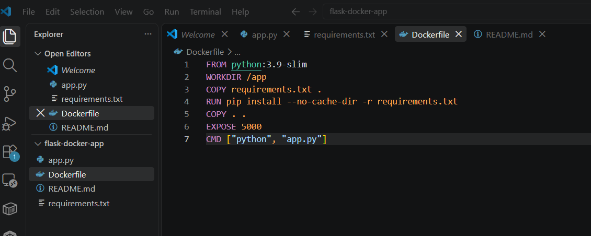
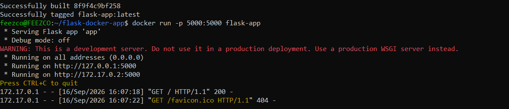
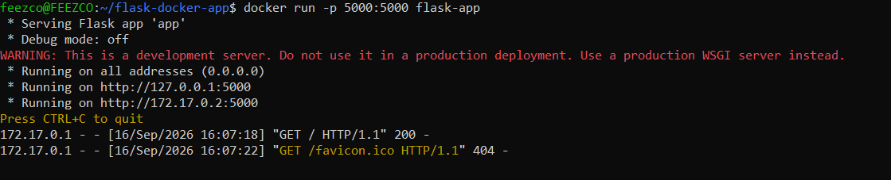
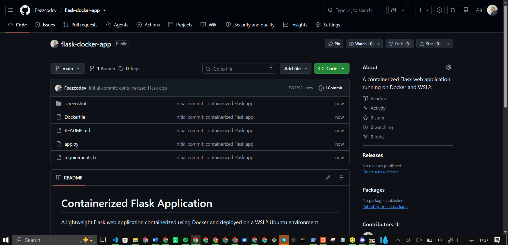

# Containerized Flask Application

A lightweight Flask web application containerized using Docker and deployed on a WSL2 Ubuntu environment.

## 🚀 Features
* Flask web server running inside a Python slim Docker container.
* Isolated environment using WSL2 and Docker Desktop.
* Mapped port configuration for local browser accessibility.

## 🛠️ Prerequisites
Make sure you have the following installed on your system:
* Windows Subsystem for Linux (WSL2 with Ubuntu)
* Docker Desktop

## 📦 Project Structure
```text
flask-docker-app/
├── app.py
├── Dockerfile
└── requirements.txt

## Screenshots

| App Code & Dockerfile | Build Success | Running Server | Browser Output | Repository Files |
| :---: | :---: | :---: | :---: | :---: |
|  |  |  |  |  |